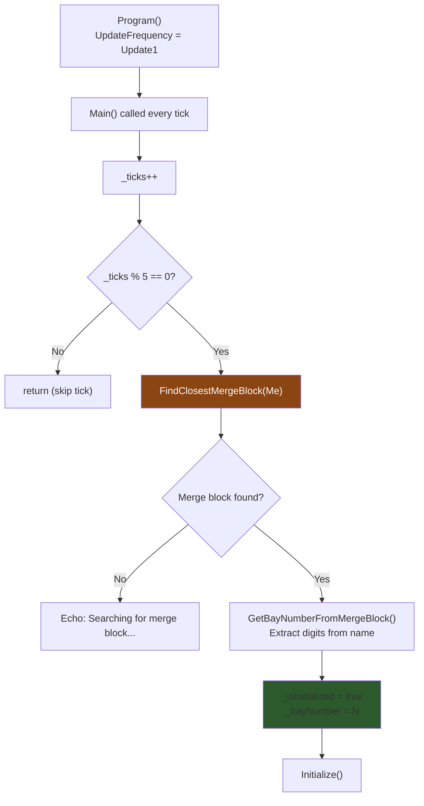
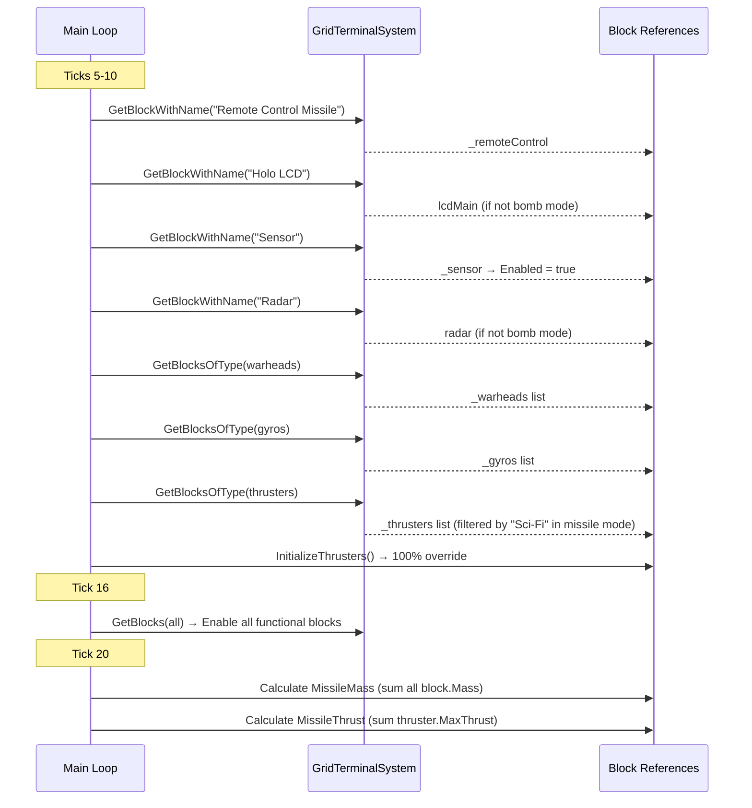

# System Architecture

## Execution Phases

The missile script operates as a tick-driven state machine inside a single `Program.Main()` method. Four distinct phases execute sequentially based on status flags.

```mermaid
flowchart TD
    ENTRY["Program.Main(arg, updateSource)"] --> DET{"arg == 'detonate'?"}
    DET -- "Yes" --> BOOM["DetonateWarheads()"]
    DET -- "No" --> BOMB{"armtype == 'bomb'?"}
    BOMB -- "Yes" --> NAV9["_navConstant = 9.0"]
    BOMB -- "No" --> INIT
    NAV9 --> INIT

    INIT{"_isInitialized?"}
    INIT -- "No" --> PHASE1["Phase 1: Find Merge Block\n_ticks % 5 → FindClosestMergeBlock()\n→ GetBayNumberFromMergeBlock()\n→ Initialize()"]
    INIT -- "Yes" --> STARTED{"_isStarted?"}

    STARTED -- "No" --> PHASE2["Phase 2: Wait for Launch\nCheckForGPSAndStart()\nParse CustomData flags\nWait for merge disconnect"]
    STARTED -- "Yes" --> TICKS{"_ticks < 100?"}

    TICKS -- "Yes" --> PHASE3["Phase 3: Early Startup\nInitialize blocks (ticks 5-10)\nOrient toward target (ticks 15-30)\nCalculate mass/thrust (tick 20)\nAdd lofted waypoints if topdown"]
    TICKS -- "No" --> PHASE4["Phase 4: Active Guidance\nAnti-air update → Radar tracking\n→ Detonation check → ProNav\n→ Gyro steering → Thrust modulation\n→ LCD telemetry"]

    style PHASE1 fill:#2d5a2d
    style PHASE2 fill:#2d4a5a
    style PHASE3 fill:#8b4513,color:#fff
    style PHASE4 fill:#2d5a2d
```

> Green = core execution. Blue = waiting state. Brown = critical one-time initialization.

**Source:** `Program.cs` — `Main()` method, lines 149-600

---

## Initialization Flow

Bay detection runs every 5 ticks until a merge block with "Bay" in its name is found:

**Source:** `Program.cs` — lines 160-180 (initialization), lines 874-910 (FindClosestMergeBlock, GetBayNumberFromMergeBlock)

---

## Tick Timeline

```mermaid
flowchart LR
    subgraph Phase1 ["Phase 1"]
        T0["Ticks 0-5\nMerge block search\n(every 5 ticks)"]
    end

    subgraph Phase2 ["Phase 2"]
        TW["Waiting\nCheckForGPSAndStart()\nMonitor merge block"]
    end

    subgraph Phase3 ["Phase 3: Early Startup"]
        T5["Ticks 5-10\nRemote Control\nLCD, Radar\nWarheads, Gyros\nThrusters"]
        T15["Ticks 15-30\nOrient toward target\nEnable all blocks\nCalc mass/thrust\nLofted waypoints"]
        T30["Ticks 30-100\nWait for stability"]
    end

    subgraph Phase4 ["Phase 4"]
        T100["Ticks 100+\nFull guidance\n60 Hz loop"]
    end

    Phase1 --> Phase2 --> Phase3 --> Phase4

    style T0 fill:#2d5a2d
    style TW fill:#2d4a5a
    style T5 fill:#8b4513,color:#fff
    style T15 fill:#8b4513,color:#fff
    style T30 fill:#2d4a5a
    style T100 fill:#2d5a2d
```

### Phase Summary

| Phase | Ticks | Status Flags | Key Actions |
|-------|-------|-------------|-------------|
| 1. Initialization | 0-5 | `!_isInitialized` | Find merge block, extract bay number |
| 2. Waiting | N/A | `_isInitialized && !_isStarted` | Parse CustomData, wait for merge disconnect |
| 3. Early Startup | 5-100 | `_isStarted && _ticks < 100` | Init blocks, orient, calculate physics, add waypoints |
| 4. Active Guidance | 100+ | `_isStarted && _ticks >= 100` | ProNav at 60 Hz, radar, detonation, LCD |

**Source:** `Program.cs` — `Main()` method, lines 207-600

---

## Active Guidance Tick Flow

Every tick after tick 100, the full guidance loop executes:

```mermaid
flowchart TD
    START["Tick 100+ Entry"] --> AA{"_antiairmode\n&& armtype != 'bomb'?"}
    AA -- "Yes" --> UPDATE_TGT["Parse Cached: GPS from\nlauncher CustomData\nUpdate final waypoint"]
    AA -- "No" --> POS["Get position & velocity"]
    UPDATE_TGT --> POS

    POS["currentPos = RemoteControl.GetPosition()\ncurrentVelocity = GetShipVelocities()"] --> WPT{"Distance < WAYPOINT_THRESHOLD\n&& not final waypoint?"}
    WPT -- "Yes" --> ADVANCE["_currentWaypointIndex++"]
    WPT -- "No" --> RADAR
    ADVANCE --> RADAR

    RADAR{"radar != null\n&& armtype != 'bomb'?"}
    RADAR -- "Yes" --> RTRACK["Radar tracking:\nGetTargetedEntity()\nShootOnce() if empty\nUpdate waypoint + velocity"]
    RADAR -- "No" --> DETCHECK
    RTRACK --> DETCHECK

    DETCHECK["Detonation Check"] --> DET1{"distance < 500m\n&& raycast hit?"}
    DET1 -- "Yes" --> DETONATE["DetonateWarheads()"]
    DET1 -- "No" --> DET2{"distance <= 8m?"}
    DET2 -- "Yes" --> DETONATE
    DET2 -- "No" --> PRONAV

    PRONAV["ProNav Calculation\nLOS vectors → LOS rate\n→ Lateral acceleration\n→ Gravity compensation"] --> GYRO["GyroTurn6()\nQuaternion transform\nPID damping\nPer-gyro application"]

    GYRO --> THRUST["Thrust Modulation\nAlignment projection\n50-100% override"]

    THRUST --> LCD{"lcdMain != null\n&& _ticks % 3 == 0?"}
    LCD -- "Yes" --> DISPLAY["DisplayOnLCD()\n20 Hz update"]
    LCD -- "No" --> SAVE

    DISPLAY --> SAVE["Save previous positions\n_previousTargetPoS = targetPosition\n_oldmissilePos = currentPos"]

    style PRONAV fill:#2d5a2d
    style GYRO fill:#2d5a2d
    style DETONATE fill:#8b0000,color:#fff
    style RTRACK fill:#2d4a5a
    style UPDATE_TGT fill:#2d4a5a
```

**Source:** `Program.cs` — `Main()` method, lines 334-599

---

## Block Initialization Sequence

**Source:** `Program.cs` — lines 215-328 (block initialization)

---

## Constants

| Constant | Value | Description |
|----------|-------|-------------|
| `WAYPOINT_THRESHOLD` | 550.0 m | Distance to switch to next waypoint |
| `DETONATION_DISTANCE` | 8.0 m | Distance-based detonation trigger |
| `tickTime` | 1/60 s | Frame timestep (60 FPS) |
| `_navConstant` | 4.0 (missile) / 9.0 (bomb) | Proportional navigation constant |
| `updatesPerSecond` | 60.0 | Script update rate |
| `cooldown` (radar) | 150 ticks | Radar re-engagement cooldown |

**Source:** `Program.cs` — lines 78-113 (field declarations)
