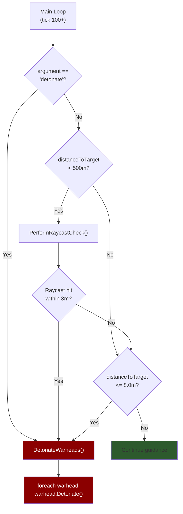
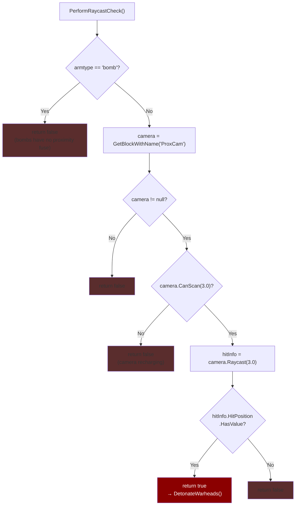
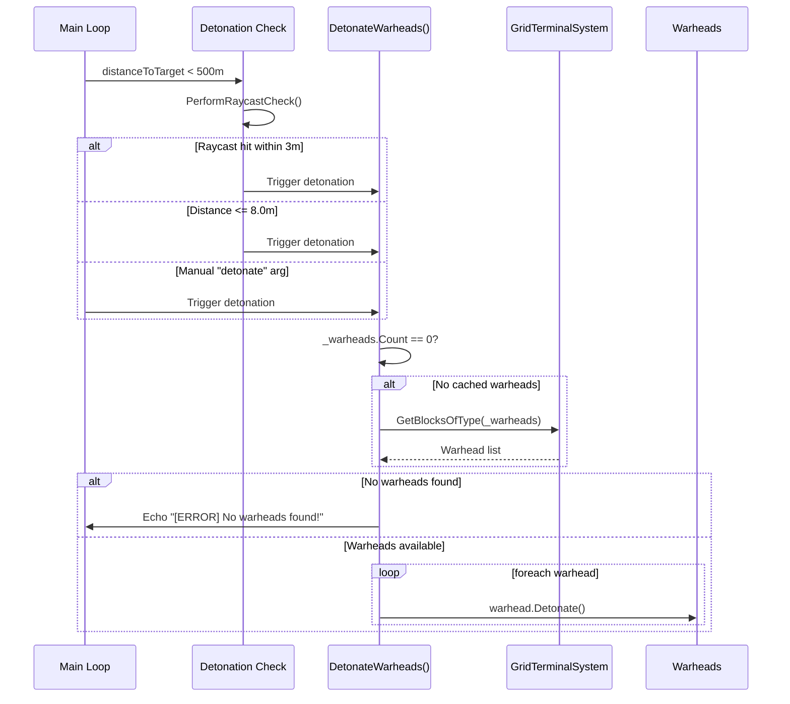

# Detonation & Warhead Management

## Detonation Decision Tree

Three independent paths can trigger warhead detonation. They are checked in priority order each tick during active guidance:

> Manual detonation via the `"detonate"` argument is checked at the very start of `Main()`, before any phase logic. This ensures it works regardless of the missile's current state.

**Source:** `Program.cs` — lines 152-155 (manual), 441-451 (proximity + distance)

---

## Proximity Raycast — PerformRaycastCheck()

The proximity fuse uses a forward-facing camera to detect nearby obstacles:

> The 3.0m raycast range is very short — essentially a contact fuse. The camera must be named "ProxCam" and oriented forward on the missile. Space Engineers cameras have a recharge time between raycasts, so `CanScan()` is checked first.

**Source:** `Program.cs` — `PerformRaycastCheck()`, lines 725-741

---

## Warhead Detonation Sequence

> Warheads are cached after the first `GetBlocksOfType` call (during tick 5-10 initialization). The redundant check in `DetonateWarheads()` is a safety net in case initialization was incomplete.

**Source:** `Program.cs` — `DetonateWarheads()`, lines 940-955

---

## Detonation Conditions by Distance

```mermaid
flowchart LR
    subgraph Always ["Any Distance"]
        MANUAL["Manual Detonation\narg == 'detonate'\nPriority: Immediate"]
    end

    subgraph Medium ["< 500m"]
        PROX["Proximity Fuse Active\nProxCam raycast\nRange: 3.0m\nRecharge-dependent"]
    end

    subgraph Close ["<= 8m"]
        CONTACT["Distance Detonation\nGPS distance check\nGuaranteed trigger"]
    end

    Always --> Medium --> Close

    style MANUAL fill:#5a4a2d
    style PROX fill:#2d4a5a
    style CONTACT fill:#8b0000,color:#fff
```

### Detonation Parameters

| Parameter | Value | Description |
|-----------|-------|-------------|
| `DETONATION_DISTANCE` | 8.0 m | Distance-based detonation trigger |
| Proximity raycast range | 3.0 m | Camera raycast distance |
| Proximity activation range | 500 m | Distance at which raycast checks begin |
| Manual trigger | `"detonate"` | Programmable block argument string |

> The 500m activation threshold for proximity checks prevents unnecessary raycasts during the cruise phase, saving camera charge for when it matters.

**Source:** `Program.cs` — lines 78-79 (constants), 441-451 (check logic), 725-741 (raycast)
