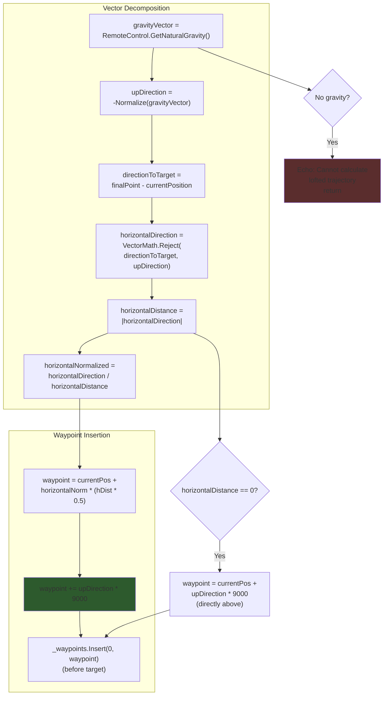
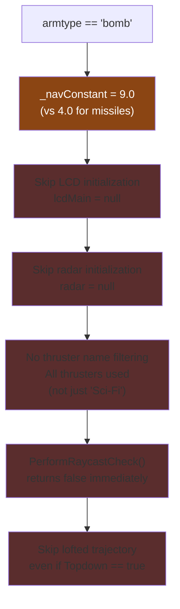

# Flight Modes & Waypoint Navigation

## Mode Selection

The missile's behavior is determined by two flags parsed from the launcher's CustomData (`armtype`, `isTopdown`, `_antiairmode`). These flags configure guidance parameters, block usage, and waypoint behavior:

```mermaid
flowchart TD
    START["Missile Launched"] --> BOMB{"armtype == 'bomb'?"}

    BOMB -- "Yes" --> BOMB_MODE["BOMB MODE\n_navConstant = 9.0\nNo radar, No LCD\nAll thrusters used\nNo Sci-Fi filter"]

    BOMB -- "No" --> TOPDOWN{"isTopdown == true?"}
    TOPDOWN -- "Yes" --> AA1{"_antiairmode?"}
    AA1 -- "Yes" --> TOPDOWN_AA["TOPDOWN + ANTI-AIR\nLofted waypoint inserted\nContinuous target updates\nRadar active"]
    AA1 -- "No" --> TOPDOWN_ONLY["TOPDOWN ONLY\nLofted waypoint inserted\nStatic GPS target\nRadar active"]

    TOPDOWN -- "No" --> AA2{"_antiairmode?"}
    AA2 -- "Yes" --> AA_MODE["ANTI-AIR MODE\nDirect pursuit\nContinuous target updates\nRadar active"]
    AA2 -- "No" --> DIRECT["DIRECT PURSUIT\nStraight to GPS target\nStatic waypoint\nRadar active"]

    style BOMB_MODE fill:#8b4513,color:#fff
    style TOPDOWN_AA fill:#2d5a2d
    style TOPDOWN_ONLY fill:#2d4a5a
    style AA_MODE fill:#5a4a2d
    style DIRECT fill:#2d5a2d
```



### Mode Comparison

| Mode | NavConstant | Radar | LCD | Thruster Filter | Waypoint Updates | Lofted |
|------|------------|-------|-----|----------------|-----------------|--------|
| Direct Pursuit | 4.0 | Yes | Yes | Sci-Fi only | Static | No |
| Anti-Air | 4.0 | Yes | Yes | Sci-Fi only | Every tick | No |
| Topdown | 4.0 | Yes | Yes | Sci-Fi only | Static | Yes (9 km) |
| Topdown + Anti-Air | 4.0 | Yes | Yes | Sci-Fi only | Every tick | Yes (9 km) |
| Bomb | 9.0 | No | No | All thrusters | Static | No |

**Source:** `Program.cs` — lines 156-159 (bomb nav constant), 218-234 (block filtering), 280-285 (topdown check)

---

## Waypoint Navigation

The missile navigates through an ordered list of waypoints. When it gets within `WAYPOINT_THRESHOLD` (550 m) of the current waypoint, it advances to the next one. The final waypoint is always the target.

```mermaid
flowchart TD
    INIT["_waypoints populated at launch\n(1 waypoint = direct GPS target)"] --> LOFT{"Topdown mode?"}
    LOFT -- "Yes" --> INSERT["AddLoftedTrajectoryWaypoints()\nInsert loft point at index 0\n_waypoints = [loft, target]"]
    LOFT -- "No" --> NAV

    INSERT --> NAV["Navigation Loop\n(every tick, tick 100+)"]
    NAV --> DIST["distanceToWaypoint =\nDistance(currentPos,\n_waypoints[_currentWaypointIndex])"]
    DIST --> CHECK{"distance < 550m &&\nnot final waypoint?"}
    CHECK -- "Yes" --> ADVANCE["_currentWaypointIndex++"]
    CHECK -- "No" --> USE["_destination =\n_waypoints[currentIndex]"]
    ADVANCE --> USE

    USE --> GUIDANCE["ProNav guides toward\n_destination"]

    style INSERT fill:#2d4a5a
    style ADVANCE fill:#2d5a2d
```



> The waypoint list is indexed from 0. In topdown mode, index 0 is the loft point and index 1 is the final target. In direct mode, only index 0 exists (the target). Anti-air mode may clear and re-add the single waypoint every tick.

**Source:** `Program.cs` — lines 379-385 (waypoint switching)

---

## Lofted Trajectory — AddLoftedTrajectoryWaypoints()

Creates an intermediate waypoint at high altitude for plunging attacks. Called once after block initialization if `isTopdown == true` and `!_antiairmode` and `armtype != "bomb"`:



### Parameters

| Parameter | Default | Description |
|-----------|---------|-------------|
| `fraction` | 0.5 | Fraction of horizontal distance for loft point placement |
| `loftHeight` | 9000 m | Vertical altitude above launch point |

**Source:** `Program.cs` — `AddLoftedTrajectoryWaypoints()`, lines 762-810

---

## Lofted Trajectory Flight Path

```mermaid
flowchart LR
    subgraph FlightPath ["Lofted Flight Path"]
        LAUNCH["Missile\nLaunch Point\n(ground level)"]
        CLIMB["CLIMB\nPhase"]
        LOFT["Loft Point\n9 km altitude\n50% horizontal distance"]
        DIVE["DIVE\nPhase"]
        TARGET["Target\n(ground level)"]
    end

    LAUNCH --> CLIMB --> LOFT --> DIVE --> TARGET

    style LOFT fill:#2d4a5a
    style LAUNCH fill:#2d5a2d
    style TARGET fill:#8b0000,color:#fff
```



```
Altitude
  9km │         ╱╲
      │        ╱  ╲
      │       ╱    ╲
      │      ╱      ╲
      │     ╱        ╲
      │    ╱          ╲
   0m │───╱────────────╲───
      └──────────────────────
      Missile  50%    Target
               ← horizontal distance →
```

> The 9 km loft height ensures the missile approaches from near-vertical, maximizing the effectiveness of top-armor attacks against ground targets. The 50% fraction places the loft point at the midpoint, creating a symmetric arc.

**Source:** `Program.cs` — `AddLoftedTrajectoryWaypoints()`, lines 762-810

---

## Bomb Mode Differences

When `armtype == "bomb"`, several systems are modified or disabled:



> The higher navigation constant (9.0 vs 4.0) makes the bomb more aggressive in its pursuit, compensating for the lack of radar guidance. Bombs are expected to be launched on ballistic-like trajectories where high maneuverability is needed to correct the descent path.

**Source:** `Program.cs` — lines 156-159, 218-234, 251-270, 725-730, 280-285

---

## Initial Orientation (Ticks 15-30)

During early startup, the missile orients itself toward the target with an upward bias to gain altitude and avoid ground collision:

```mermaid
flowchart TD
    POS["vector_to_target =\ntargetPosition - RemoteControl.GetPosition()"] --> FWD["forward_direction =\nNormalize(vector_to_target)"]

    GRAV["up_vector =\n-RemoteControl.GetTotalGravity()"] --> COMBINE["combined_direction =\nforward_direction +\n(up_vector * 0.6)"]

    FWD --> COMBINE

    COMBINE --> GYRO["ApplyGyroOverride(\ncombined_direction,\n_gyros,\nRemoteControl.WorldMatrix)"]

    subgraph Tick16 ["Tick 16: Enable All Blocks"]
        GETALL["GetBlocks(all)"] --> ENABLE["foreach: block.Enabled = true"]
    end

    subgraph Tick20 ["Tick 20: Physics Calculation"]
        MASS["MissileMass = sum(block.Mass)"]
        THRUST["MissileThrust = sum(thruster.MaxThrust)"]
    end

    style COMBINE fill:#2d5a2d
    style GYRO fill:#2d4a5a
```



> The `uplift_strength = 0.6` bias ensures the missile pitches up after launch, preventing it from diving into the ground when launched from a moving platform. The combined vector is ~60% upward + ~100% forward, creating a ~30 degree initial climb angle. This orientation phase uses `ApplyGyroOverride()` (a simpler gyro control function) rather than `GyroTurn6()` which is used during active guidance.

**Source:** `Program.cs` — lines 288-329
