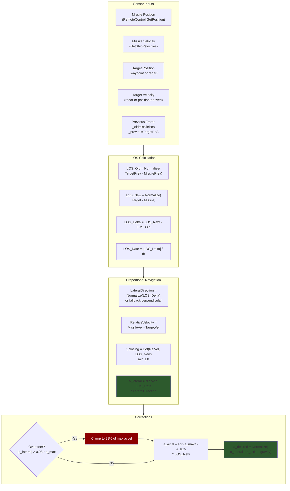
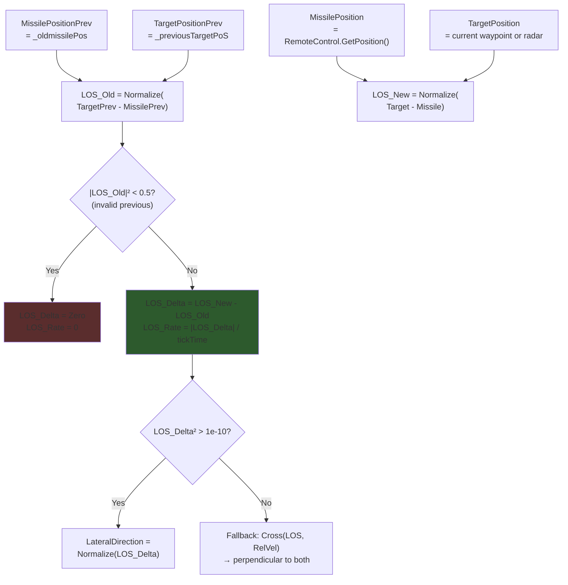
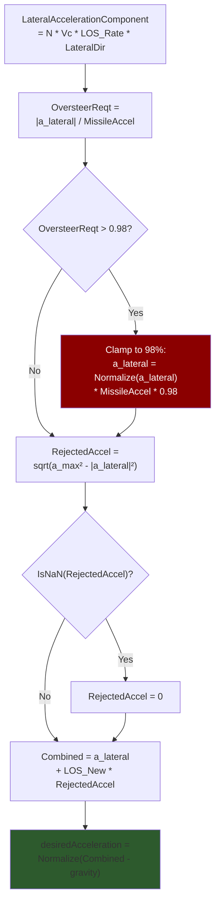

# Proportional Navigation & Steering

## Algorithm Overview

The missile uses standard Proportional Navigation (PN) to generate lateral acceleration commands that null out the line-of-sight rotation rate to the target. The full pipeline from sensor data to thruster commands:



**Source:** `Program.cs` — lines 476-547

---

## LOS Rate Calculation

The line-of-sight rate measures how fast the missile-to-target bearing is rotating. A zero LOS rate means the missile is on a collision course.



> On the first guidance frame (tick 100), previous positions are initialized to current values to prevent velocity spikes.

**Source:** `Program.cs` — lines 489-528

---

## Oversteer Correction

When the commanded lateral acceleration exceeds the missile's available thrust, the algorithm clamps lateral acceleration and redirects remaining thrust along the line of sight for closure:



> The 98% limit reserves 2% of thrust for axial closure even at maximum maneuver. The gravity subtraction ensures the missile doesn't waste thrust fighting gravity — the guidance vector already accounts for gravitational pull.

**Source:** `Program.cs` — lines 536-547

---

## Adaptive Gain System

Gyro control gain and damping adapt based on distance to target. This prevents oscillation at close range where small angular errors translate to large position errors:

```mermaid
flowchart LR
    DIST["distanceToTarget"] --> GM["gainMultiplier =\nmin(1.0, dist / 500)"]
    GM --> GAIN["adaptiveGain =\n18.0 * max(0.6, gainMultiplier)"]

    DIST --> DM["dampingFactor =\n500 / max(dist, 50)"]
    DM --> DAMP["adaptiveDamping =\n0.3 * (1 + dampingFactor)"]

    subgraph Ranges ["Effective Ranges"]
        R1["dist > 500m:\ngain = 18.0\ndamping = 0.3-0.6"]
        R2["dist = 250m:\ngain = 14.4\ndamping = 0.9"]
        R3["dist = 50m:\ngain = 10.8\ndamping = 3.3"]
    end

    GAIN --> Ranges
    DAMP --> Ranges

    style R1 fill:#2d5a2d
    style R2 fill:#2d4a5a
    style R3 fill:#5a4a2d
```



| Parameter | Formula | Min | Max |
|-----------|---------|-----|-----|
| `adaptiveGain` | `18.0 * max(0.6, min(1.0, dist/500))` | 10.8 | 18.0 |
| `adaptiveDamping` | `0.3 * (1 + 500/max(dist, 50))` | ~0.6 | ~3.3 |

> The 60% minimum gain floor (10.8) was tuned after testing showed that lower values caused the missile to miss by 500m at close range.

**Source:** `Program.cs` — lines 549-556

---

## Gyro Control Pipeline — GyroTurn6()

The core steering function transforms the world-space desired acceleration vector into per-gyro pitch/yaw/roll override commands using quaternion reference frame transforms:

```mermaid
flowchart TD
    subgraph RefFrame ["Reference Frame Transform"]
        FWD["ShipForward = Thruster.WorldMatrix.Backward\n(thrusters point backward)"]
        UP["ShipUp = Thruster.WorldMatrix.Up"]
        QUAT["Quaternion = CreateFromForwardUp(\nShipForward, ShipUp)"]
        INV["InvQuat = Inverse(Quaternion)"]
        XFORM["RCFrame = Transform(\nTargetVector, InvQuat)"]
        ANGLES["GetAzimuthAndElevation(\nRCFrame → Azimuth, Elevation)"]
    end

    subgraph PID ["PID Damping"]
        DAZ["Azimuth += DampingGain *\n(Azimuth - YawPrev) / tickTime"]
        DEL["Elevation += DampingGain *\n(Elevation - PitchPrev) / tickTime"]
    end

    subgraph PerGyro ["Per-Gyro Application"]
        REFMAT["REF_Matrix = CreateWorld(\nREF.Position, ShipForward, ShipUp)"]
        WORLD["WorldVector = Transform(\n(Elevation, Azimuth, 0), REF_Matrix)"]
        LOCAL["GyroLocal = Transform(\nWorldVector, Transpose(GYRO.WorldMatrix))"]
        NAN{"Any NaN?"}
        NAN -- "Yes" --> SKIP["return (skip frame)"]
        NAN -- "No" --> APPLY["GYRO.Pitch = Clamp(-X * Gain, -500, 500)\nGYRO.Yaw = Clamp(-Y * Gain, -500, 500)\nGYRO.Roll = Clamp(-Z * Gain, -500, 500)\nGYRO.GyroOverride = true"]
    end

    RefFrame --> PID --> PerGyro

    style QUAT fill:#2d4a5a
    style APPLY fill:#2d5a2d
    style SKIP fill:#5a2d2d
```



### GyroTurn6 Parameters

| Parameter | Type | Description |
|-----------|------|-------------|
| `TARGETVECTOR` | Vector3D | World-space desired acceleration direction |
| `GAIN` | double | Proportional gain (adaptive, 10.8-18.0) |
| `DAMPINGGAIN` | double | Derivative damping (adaptive, 0.6-3.3) |
| `REF` | IMyTerminalBlock | Reference block (first thruster) |
| `GYRO` | IMyGyro | Target gyroscope |
| `YawPrev` / `PitchPrev` | double | Previous frame azimuth/elevation for PID |
| `out NewPitch` / `out NewYaw` | double | Updated angles for next frame |

> The function uses the thruster as reference (not the remote control) because `WorldMatrix.Backward` gives the thrust direction, which is the missile's forward axis.

**Source:** `Program.cs` — `GyroTurn6()` method, lines 603-646

---

## Thrust Modulation

Thrust is modulated between 50-100% based on how well the missile's forward axis aligns with the desired acceleration vector:

```mermaid
flowchart TD
    FWD["MissileForwards =\nThruster[0].WorldMatrix.Backward"] --> DOT["ThrustPower =\nVector_Projection_Scalar(\nMissileForwards,\nNormalize(LateralAccelComponent))"]

    DOT --> CLAMP["ThrustPower = Clamp(\nThrustPower, 0.5, 1.0)"]

    CLAMP --> DAMP["DampenersOverride = false"]
    DAMP --> LOOP["foreach thruster:"]
    LOOP --> CALC["targetOverride =\nMaxThrust * ThrustPower"]
    CALC --> CHANGED{"|current - target| > 0.01?"}
    CHANGED -- "Yes" --> SET["thruster.ThrustOverride =\ntargetOverride"]
    CHANGED -- "No" --> SKIP["Skip (reduce command overhead)"]

    style CLAMP fill:#2d5a2d
    style SET fill:#2d4a5a
```



> When the missile is perfectly aligned with its target, thrust is 100%. When turning hard (alignment < 0.5), thrust stays at 50% — enough forward momentum to maintain control authority while conserving energy for lateral maneuvers. The 0.01 threshold check prevents unnecessary API calls to the game engine.

**Source:** `Program.cs` — lines 568-585

---

## ProNav Math Summary

The complete proportional navigation law implemented:

### Core PN Equation

```
a_lateral = N * Vc * LOS_rate * LateralDirection
```

Where:
- `N` = navigation constant (4.0 for missiles, 9.0 for bombs)
- `Vc` = closing velocity = `Dot(MissileVel - TargetVel, LOS_New)`, minimum 1.0
- `LOS_rate` = `|LOS_New - LOS_Old| / dt`
- `LateralDirection` = `Normalize(LOS_Delta)` or perpendicular fallback

### Oversteer Handling

```
if |a_lateral| > 0.98 * a_max:
    a_lateral = Normalize(a_lateral) * a_max * 0.98

a_axial = sqrt(a_max² - |a_lateral|²) * LOS_direction
```

### Final Desired Acceleration

```
a_desired = Normalize(a_lateral + a_axial - gravity)
```

### Gyro Commands

```
(Azimuth, Elevation) = GetAzimuthAndElevation(Transform(a_desired, InvQuat))
Azimuth  += DampingGain * (Azimuth - Prev) / dt
Elevation += DampingGain * (Elevation - Prev) / dt
Gyro.Pitch/Yaw/Roll = Clamp(-LocalTransform * Gain, -500, 500)
```

### Thrust

```
ThrustPower = Clamp(Dot(MissileForward, Normalize(a_lateral)), 0.5, 1.0)
```
