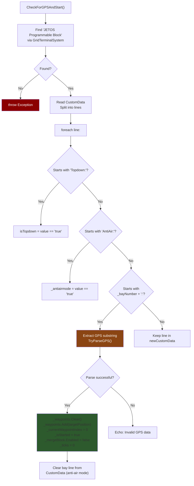
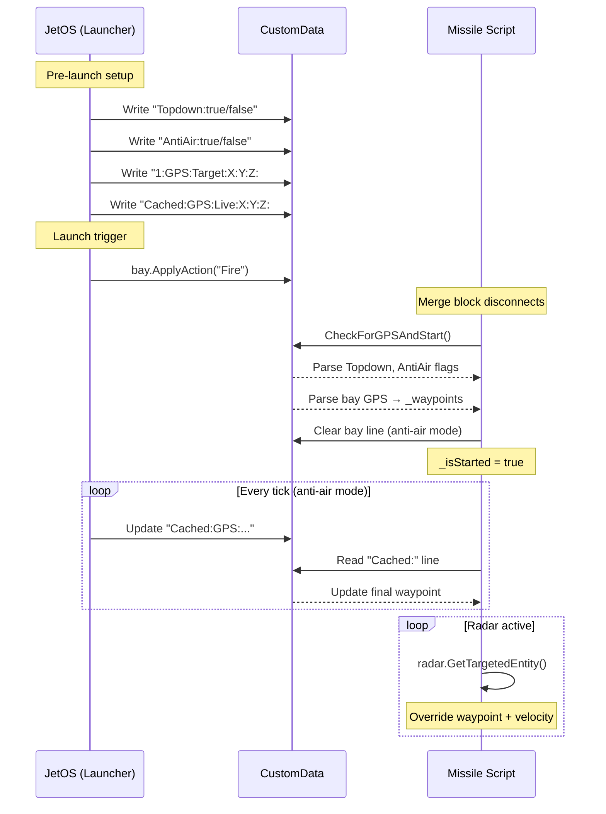

# Target Acquisition & Tracking

## Overview

Target data flows from the launcher platform through CustomData to the missile, with optional real-time updates via anti-air mode and onboard radar. Three independent data sources can update the missile's final waypoint.

```mermaid
flowchart TD
    subgraph Launcher ["Launcher Platform (JETOS)"]
        PB["JETOS Programmable Block\nCustomData"]
        BAY_GPS["Bay GPS Lines\n1:GPS:Target:X:Y:Z:#Color:"]
        CACHED["Cached:GPS:...\n(live target position)"]
        FLAGS["Topdown: true/false\nAntiAir: true/false"]
    end

    subgraph Missile ["Missile Script"]
        PARSE["CheckForGPSAndStart()\nOne-time GPS parsing"]
        AA_UPDATE["Anti-Air Update\nEvery tick at 60 Hz"]
        WPT["_waypoints\nList&lt;Vector3D&gt;"]
        IDX["_currentWaypointIndex"]
    end

    subgraph Radar ["Onboard Radar"]
        TURRET["IMyLargeGatlingTurret\n'Radar'"]
        DETECT["detectedEntity\nMyDetectedEntityInfo"]
    end

    subgraph Guidance ["Guidance Consumer"]
        PRONAV["ProNav Algorithm\nLOS vectors + acceleration"]
    end

    BAY_GPS --> PARSE
    FLAGS --> PARSE
    PARSE --> WPT

    CACHED --> AA_UPDATE
    AA_UPDATE --> |"Replace final waypoint"| WPT

    TURRET --> DETECT
    DETECT --> |"Update position + velocity"| WPT

    WPT --> IDX --> PRONAV

    style PARSE fill:#8b4513,color:#fff
    style AA_UPDATE fill:#2d4a5a
    style DETECT fill:#2d5a2d
```



---

## GPS Parsing — CheckForGPSAndStart()

Called every tick while `!_isStarted`. Reads the launcher's CustomData, parses mode flags, finds the GPS line matching this missile's bay number, and initiates launch:



> In anti-air mode, the missile clears its bay line from the launcher's CustomData after reading it. This prevents re-reading stale data and signals to the launcher that the bay is consumed.

**Source:** `Program.cs` — `CheckForGPSAndStart()`, lines 651-706

---

## Anti-Air Continuous Update

When `_antiairmode == true` and `armtype != "bomb"`, the missile re-reads the launcher's CustomData every tick to get the latest target position:

```mermaid
flowchart TD
    CHECK{"_antiairmode &&\narmtype != 'bomb'?"}
    CHECK -- "No" --> SKIP["Use static waypoint"]
    CHECK -- "Yes" --> READ["Read programmableBlock.CustomData\nSplit into lines"]

    READ --> LOOP["foreach line:"]
    LOOP --> CACHED{"Starts with 'Cached:'?"}
    CACHED -- "No" --> NEXT["Continue to next line"]
    CACHED -- "Yes" --> EXTRACT["Extract GPS substring\nafter first ':'"]
    EXTRACT --> EMPTY{"Empty string?"}
    EMPTY -- "Yes" --> NEXT
    EMPTY -- "No" --> PARSE["TryParseGPS(gpsData,\nout targetPosition)"]
    PARSE --> OK{"Parse OK?"}
    OK -- "Yes" --> UPDATE["_waypoints.Clear()\n_waypoints.Add(targetPosition)\n_currentWaypointIndex = 0"]
    OK -- "No" --> NEXT
    UPDATE --> BREAK["break — found Cached line"]

    style UPDATE fill:#2d5a2d
    style CACHED fill:#2d4a5a
```



> The Cached GPS line is written by the launcher's targeting system (JetOS) which updates it with the latest enemy position from radar or raycast. This gives the missile real-time target updates at 60 Hz.

**Source:** `Program.cs` — lines 338-361

---

## Radar Target Acquisition

The onboard radar (a gatling turret named "Radar") provides terminal guidance refinement. When it detects a target, it overrides the waypoint with the radar's detected position and extracts target velocity:

```mermaid
flowchart TD
    GUARD{"radar != null &&\narmtype != 'bomb'?"}
    GUARD -- "No" --> SKIP["Skip radar"]
    GUARD -- "Yes" --> ENABLE["radar.Enabled = true\nradar.Shoot = true\nradar.TargetEnemies = true\nradar.TargetStations = true"]

    ENABLE --> GET["detectedEntity =\nradar.GetTargetedEntity()"]
    GET --> EMPTY{"detectedEntity.IsEmpty()?"}

    EMPTY -- "No" --> LOCK["Update from radar lock:\n_waypoints[last] = detectedEntity.Position\ntargetvelocity = detectedEntity.Velocity\ntargetPosition = detectedEntity.Position"]

    EMPTY -- "Yes" --> RANGE{"distanceToTarget\n< 6000m?"}
    RANGE -- "No" --> COOLDOWN_DEC
    RANGE -- "Yes" --> CD{"cooldown <= 0?"}
    CD -- "No" --> COOLDOWN_DEC["cooldown -= 1\nmin 0"]
    CD -- "Yes" --> SHOOT["radar.ShootOnce()\ncooldown = 150\nradar.Enabled = true\nradar.ShootOnce()\nReset azimuth/elevation"]
    SHOOT --> REGET["detectedEntity =\nradar.GetTargetedEntity()"]
    REGET --> RECHECK{"IsEmpty?"}
    RECHECK -- "No" --> LOCK
    RECHECK -- "Yes" --> COOLDOWN_DEC

    style LOCK fill:#2d5a2d
    style SHOOT fill:#2d4a5a
    style COOLDOWN_DEC fill:#5a2d2d
```



> The double `ShootOnce()` call with a disable/re-enable cycle is a workaround for Space Engineers' AI block behavior — it forces the turret to re-scan when the target is temporarily lost. The 150-tick cooldown prevents excessive API calls.

**Source:** `Program.cs` — lines 387-428

---

## Target Update Priority

When multiple target sources are available, the missile applies them in this priority order within the same tick:

```mermaid
flowchart TD
    START["Each Guidance Tick"] --> AA{"Anti-air mode?"}
    AA -- "Yes" --> CACHED["Read Cached: GPS\nfrom launcher CustomData"]
    AA -- "No" --> STATIC["Use static GPS\nfrom launch time"]

    CACHED --> RADAR{"Radar has target?"}
    STATIC --> RADAR

    RADAR -- "Yes" --> RADAR_DATA["OVERRIDE:\nPosition = detectedEntity.Position\nVelocity = detectedEntity.Velocity\n(highest precision)"]
    RADAR -- "No" --> KEEP["Keep current waypoint\nVelocity = Zero or Cached"]

    RADAR_DATA --> PRONAV["ProNav uses:\ntargetPosition + targetvelocity"]
    KEEP --> PRONAV

    style RADAR_DATA fill:#2d5a2d
    style CACHED fill:#2d4a5a
    style STATIC fill:#5a4a2d
```



> Radar data always wins because it provides both position AND velocity, enabling true lead-pursuit intercept geometry. CustomData GPS only provides position — velocity must be derived from position differences.

**Source:** `Program.cs` — lines 338-428 (combined update logic)

---

## Launcher-Missile Communication



**Source:** `Program.cs` — lines 651-706 (CheckForGPSAndStart), lines 338-361 (anti-air update)

---

## GPS Format

The `TryParseGPS()` function expects Space Engineers GPS format:

```
GPS:Name:X:Y:Z:#Color:
```

| Part | Index | Description |
|------|-------|-------------|
| `GPS` | 0 | Prefix identifier |
| `Name` | 1 | Target name (ignored by parser) |
| `X` | 2 | X coordinate (double) |
| `Y` | 3 | Y coordinate (double) |
| `Z` | 4 | Z coordinate (double) |
| `#Color` | 5 | Color hex (ignored by parser) |

The parser splits on `:` and requires at least 5 parts. Only indices 2, 3, 4 are used for the `Vector3D` position.

**Source:** `Program.cs` — `TryParseGPS()`, lines 708-723
