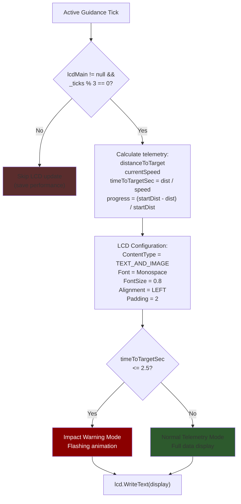
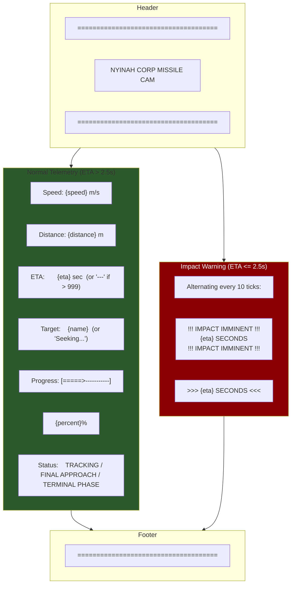
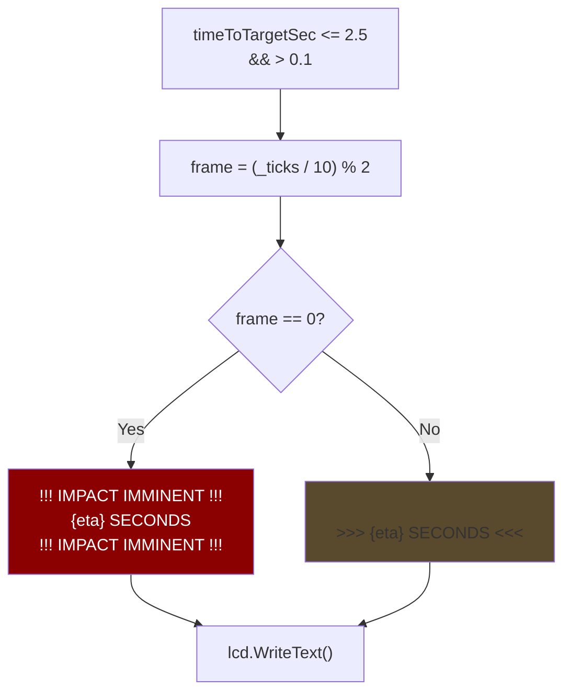

# LCD Display & Telemetry

## Update Pipeline

The LCD updates at 20 Hz (every 3 ticks) rather than the guidance rate of 60 Hz. This reduces computational overhead while maintaining smooth visual output:

**Source:** `Program.cs` — lines 596-599 (tick check), 956-1033 (DisplayOnLCD)

---

## Display Layout

The LCD output uses monospace text to create a structured telemetry display:

### Display Fields

| Field | Source | Format | Condition |
|-------|--------|--------|-----------|
| Speed | `currentSpeed` | `F0` (integer m/s) | Always |
| Distance | `distanceToTarget` | `F0` (integer m) | Always |
| ETA | `distanceToTarget / currentSpeed` | `F1` (1 decimal s) | < 999s |
| Target | `detectedEntity.Name` | String | Radar has target |
| Progress | `(startDist - dist) / startDist` | 25-char bar | Always |
| Status | Distance thresholds | String | See below |

### Status Thresholds

| Distance | Status Label |
|----------|-------------|
| > 500 m | `TRACKING` |
| 100-500 m | `FINAL APPROACH` |
| < 100 m | `TERMINAL PHASE` |

**Source:** `Program.cs` — `DisplayOnLCD()`, lines 956-1033

---

## Impact Warning Animation

When time-to-impact drops below 2.5 seconds, the display switches to a flashing warning mode:

> The flash rate is 10 ticks per frame (~167ms per state at 60Hz), creating a rapid 3 Hz blink effect. The 0.1s lower bound prevents the warning from displaying during the detonation frame.

**Source:** `Program.cs` — lines 977-992
